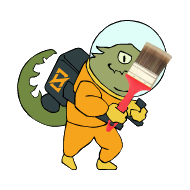
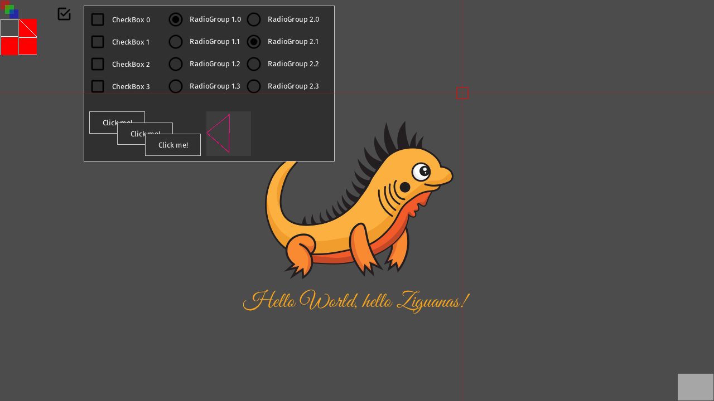
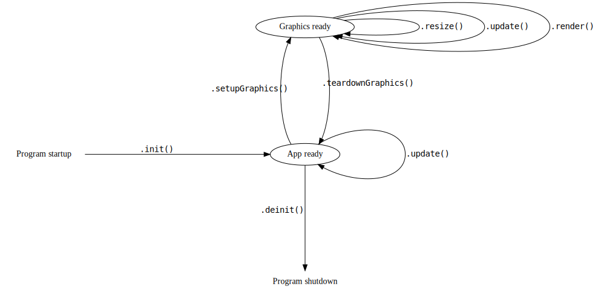

# Zero Graphics

A very minimal OpenGL ES 2.0 library for Zig. Opens you a window and let's you draw things.
Comes with a pixel-perfect 2D renderer and maybe some day even with a bit of a 3D api.



## Features

- Multi-platform support
  - Desktop (Linux, MacOS, Windows, ...)
  - WebAssembly
  - Android
- Pixel perfect 2D rendering
  - Primitives (line, rectangle, triangle, ...)
  - Text / TTF fonts
  - Textures
- Basic 3D rendering
  - Multi-mesh models with flat textures
- Zig-style immediate-mode user interface
- Proper DPI scaling support in renderer

## Project status

### CI

The CI coverage currently looks like this:

| ·              | Windows | macOS | Linux |
| -------------- | ------- | ----- | ----- |
| Desktop        | ✅      | ✅    | ✅    |
| WebAssembly    | ✅      | ✅    | ✅    |
| Android        | ✅      | ✅    | ✅    |
| `zero-init`    | ✅      | ✅    | ✅    |
| `zero-convert` | ✅      | ✅    | ✅    |

Status: [](https://github.com/MasterQ32/zero-graphics/actions/workflows/nightly.yml)

### Previews

Work-in-progress, but works quite well already. There is one [big project](https://github.com/Dunstwolke/core) depending on it and is used as a _real-world application_ driver behind _Zero Graphics_.




## Project Goals

### Basic Framework

- [ ] Support the following platforms
  - [x] Wasm
    - [x] Create OpenGL ES 2.0 context
    - [x] Input Mouse
    - [x] Input Keyboard
  - [ ] Linux Desktop
    - [x] Create OpenGL ES 2.0 context
    - [x] Input Mouse
    - [ ] Input Keyboard
  - [ ] Windows Desktop (not tested, but should work via SDL2)
  - [ ] Android
    - [x] Create OpenGL ES 2.0 context
    - [x] Input Mouse
    - [ ] Input Keyboard
- [x] Create an OpenGL ES 2.0 context
- [x] Provide input events
  - [x] Single pointer motion (finger or mouse)
  - [x] Single click event (finger, mouse)
  - [ ] Text input for keyboard (utf-8 encoded)
- [x] Provide window events
  - [x] Resize
  - [x] Close
- [x] Provide access to the underlying backend
- [ ] Allow creation of single-file applications
  - [ ] Single executable for easy distribution
  - [ ] Embedded resources

### 2D Rendering library

- [ ] Pixel perfect drawing of
  - [x] Lines
  - [x] Rectangles
  - [ ] Images
    - [x] Basic "copy full texture to rectangle"
    - [ ] Copy portion of texture ("atlas rendering")
- [x] TTF font rendering via [`stb_ttf`](https://github.com/nothings/stb)
- [x] Image loading via [`zigimg`](https://github.com/zigimg/zigimg)
- [ ] Stack based/nested scissoring

### 3D Rendering library

- [ ] Tool based on Assimp to convert models into loadable format
  - [x] static geometry
  - [ ] dynamic/animated geometry
- [ ] Blender export script
- [x] Draw static geometry
- [ ] Draw animated geometry
  - [ ] Skinning based on skeletons
- [ ] Axis- and camera aligned billboards
- [ ] Basic particles
- [ ] Tiny built-in pipeline with
  - [ ] shadow mapping
  - [ ] planar reflections
  - [ ] water reflections

## Dependencies

### Desktop

- [SDL2](https://www.libsdl.org/)

### Web

- [js glue code](www/zero-graphics.js)
- [root page](www/application.ztt)

### Android

- Android SDK
- Android NDK
- Android Build Tools
- OpenJDK
- some other tools

## Building / Running

This project uses [submodules](https://git-scm.com/book/en/v2/Git-Tools-Submodules), so to get started, clone the repo with submodules recursively:

```sh-session
[user@computer work]$ git clone https://github.com/MasterQ32/zero-graphics --recurse-submodules
```

or, if you already cloned the repository:

```sh-session
[user@computer work]$ git clone https://github.com/MasterQ32/zero-graphics
[user@computer work]$ cd zero-graphics/
[user@computer zero-graphics]$ git submodule update --init --recursive
```

### Desktop PC

Requires `SDL2` to be installed.

```sh-session
[user@computer zero-graphics]$ zig build run
```

A window should open with the application in fullscreen.

### Web/Wasm version

Includes a teeny tiny web server for debugging.

```sh-session
[user@computer zero-graphics]$ zig build install run-wasm
```

Now visit http://127.0.0.1:8000/demo_application.htm to see the demo.

### Android

Connect your phone first and install both a JDK as well as the Android SDK with NDK included. The ZeroGraphics build system will tell you if
it couldn't auto-detect the SDK paths.

```sh-session
[user@computer zero-graphics]$ zig build -Denable-android run-app
```

The app should now be installed and started on your phone.

## Documentation

### Getting started

To create a new project, copy this application skeleton:

```zig
const std = @import("std");
const zero_graphics = @import("zero-graphics");

/// This implements your application with all state
const Application = @This();

allocator: *std.mem.Allocator,
input: *zero_graphics.Input,

pub fn init(app: *Application, allocator: *std.mem.Allocator, input: *zero_graphics.Input) !void {
    // Initialize the app and all non-gpu logic here
    app.* = Application{
        .allocator = allocator,
        .input = input,
    };
}

pub fn deinit(app: *Application) void {
    // destroy application data here
    app.* = undefined;
}

pub fn setupGraphics(app: *Application) !void {
    // initialize all OpenGL objects here
}

pub fn teardownGraphics(app: *Application) void {
    // destroy all OpenGL objects here
}

pub fn update(app: *Application) !bool {
    while (app.input.pollEvent()) |event| {
        switch (event) {
            .quit => return false,
            else => std.log.info("unhandled input event: {}", .{event}),
        }
    }

    // return false to exit the application
    return true;
}

pub fn resize(app: *Application, width: u15, height: u15) !void {
    // handle application resize logic here
}

pub fn render(app: *Application) !void {
    // OpenGL is already loaded, so we can just use it :)
    // render will never be called before `setupGraphics` is called and never
    // after `teardownGraphics` was called.
    zero_graphics.gles.clearColor(0.3, 0.3, 0.3, 1.0);
    zero_graphics.gles.clear(gles.COLOR_BUFFER_BIT);
}
```

The functions are roughly called in this order:



The separation between _application init_ and _graphics init_ is relevant for Android apps which will destroy their window when you send it into the background and will recreate it when it is selected again. This means that all GPU content will be lost then and must be restored.

Your application state will not be destroyed, so the rendering can render the same data as before.

### Architecture

`zero-graphics` follows a somewhat unusual architecture for Zig applications.
Your applications is a _package_ that will be consumed by a `zero-graphics` host. This host is implementing the "main loop" and will invoke both `update` and `render` periodically. It will also initialize and open the window and pump events.

This design allows `zero-graphics` to run on several different platforms, including most desktop PCs, Android and even web browsers via WebAssembly.

You can check out the [Sdk.zig](Sdk.zig) file to find out how a application is built.
